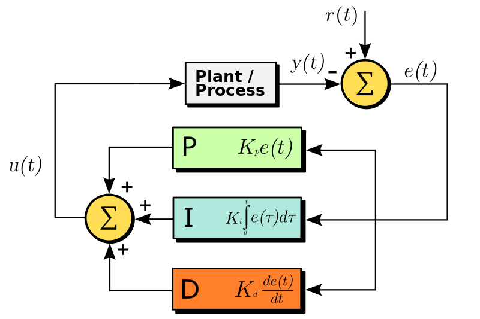

#PID Controller
>Authors - Simon Groenborg and Robert Elving

###Introduction
This report is written as an explanation and documentation for the chosen subject, PID controllers, in the course AI and Algorithms, on 4th semester spring 2015. This report is our examination material, which also includes our own data analysis and conclusion, along with our code implementation. This specific code implementation has been made for a drone, powered by an Arduino Mega 2560, which is needed, along with the Arduino IDE, if it is desired to run the program.  

###Subject explanation
For the fifth hand-in, we chose to work with different algorithms used in drone stabilization. For this we chose PID controllers:
- A Proportional-Derivative (PD) implementation.
- A Proportional-Integral-derivative (PID) implementation

We have made a PID controller, which is able to stabilize a drone. The PD implementation was just for testing, and is not included, since PID is the final and most effective solution. 

###PID - Proportional Integral Derivative 

A proportional-integral-derivative controller, is a closed feedback control loop. This control system is widely used in industrial control systems. The general concept is that we want to calculate an error value based on the difference between a setpoint value and a meassured variable. The controller then try to adjust the system, so as to minimize this error value. This algorithm involves three seperate constant parameters, which is why it is also referenced as a three-term controller, the proportional, integral and derivative values. 
- P - The proportional depends on the present error
- I - The integral accumulates the past errors 
- D - The derivative is a prediction of future errors, based on current rate of change. 

The weighted sum of these three actions is what we use to adjust our system. In our implementation, you will see that we use the error to calculate and deligate thrust to our engines. 

###Our Calculations
The controller system includes three functions, we have adjusted to match our own values. This is the math we have implemented in our own closed feedback-loop. The speedconversion can be found in our code.

\\[
P = {K_p} \cdot {V_e}
\\]
\\[
I = \sum_{x=1}^{n}\frac{{V_e}(t(x))}{n}
\\]
\\[
D = {K_d} \cdot {V_e} - {V_{el}}
\\]
\\[
Weight = P + I+ D
\\]

###Pseudo code

// measure the error (angle in degrees)

// calculate proportional value

// add error to error-buffer

// calculate integral value

// calculate derivative value

// calculate sum of PID

// translate error sum to speed value

// use calculated speed, to to distribute speed between motors

// set error to last-error

###The code
**Pid_stabilizer h_file**
~~~c++
#ifndef pid_stabilizer_h
#define pid_stabilizer_h

#include <Arduino.h>
#include <sliding_buffer.h>

class PidControl{

public:

	//constructor
	PidControl(float Kp, float Ki, float Kd, int bufferSize);
	~PidControl();

	//calculate each individual values
	float proportional(float error);
	float integral(float error);
	float derivative(float error, float lastError);

	//set each constant value
	void setProportionalConstant(float proportionalValue);
	void setIntegralConstant(float integralValue);
	void setDerivativeConstant(float derivativeValue);
	void setBufferSize(int bufferSize);

	//calculates Full PID value
	float calcPID(float error);

private:

	float _Kp;
	float _Ki;
	float _Kd;

	float _lastError;
	SlidingBuffer *_buffer;

};

#endif
~~~
**Pid_stabilizer cpp_file**
~~~c++
#include <Arduino.h>
#include <sliding_buffer.h> 
#include "pid_stabilizer.h"

PidControl::PidControl(float Kp, float Ki, float Kd, int bufferSize){
	_Kp = Kp;
	_Ki = Ki;
	_Kd = Kd;
	_buffer = new SlidingBuffer(bufferSize);

	_lastError = 0;
}

PidControl::~PidControl(){}

float PidControl::proportional(float error){
	return _Kp * error;
}

float PidControl::integral(float error){
	return _Ki * _buffer->add(error);
}

float PidControl::derivative(float error, float lastError){
	return _Kd * (error - lastError);
}

void PidControl::setProportionalConstant(float proportionalValue){
	_Kp = proportionalValue;
}
void PidControl::setIntegralConstant(float integralValue){
	_Ki = integralValue;
}
void PidControl::setDerivativeConstant(float derivativeValue){
	_Kd = derivativeValue;
}
void PidControl::setBufferSize(int bufferSize){
	_buffer = new SlidingBuffer(bufferSize);
}

float PidControl::calcPID(float error){

	float val = proportional(error) + integral(error) + derivative(error , _lastError); 
	_lastError = error;

	return val;

}
~~~
**Arduino implementation**
~~~c++
#include <Engine.h>
#include <pid_stabilizer.h>
#include <sliding_buffer.h>

#include <Controller.h>
#include <Servo.h>
#include <PS3BT.h>
#include <FreeSixIMU.h>
#include <FIMU_ADXL345.h>
#include <FIMU_ITG3200.h>
#include <Wire.h>

Engine *engine; 
Controller control;
FreeSixIMU sixDOF = FreeSixIMU();

float angles[3]; // yaw pitch roll
float angleOffset = 0.0f;

float error; 
float errorSum = 0.0f;
float speedSum = 0.0f;
float Kp = 2.0f;   
float Ki = 4.0f;   
float Kd = 100.0f;   
float maxVal = 100.0f;
float minVal = 25.0f;
float md = (maxVal + minVal)/2;
float range = md - minVal;
int bufferSize = 1000;

PidControl pidControl(Kp,Ki,Kd, bufferSize);

void setup() {
  Serial.begin(9600);
  engine = new Engine(2,3,4,5);
  engine->armEngine();
  Wire.begin();
  delay(5);
  sixDOF.init(); //begin the IMU
  delay(5);
  calibrateGyro();
}

void loop() {
  sixDOF.getEuler(angles);
   
  // calculate error  
  error = (angles[2] - angleOffset)/180.0f;
  
  // calculate weighted PID value
  speedSum = pidControl.calcPID(error); 
  
  // control speed boundaries
  if(speedSum > 1.0f) speedSum = 1.0f;
  if(speedSum < -1.0f) speedSum = -1.0f;
  
  // calculates speed
  float actSpeed = calculateSpeed();
  float actSpeedOpp = (md * 2) - actSpeed;
  
   // apply adjustment to engines
   engine->engineSW(actSpeed + 0.0f);
   engine->engineSR(actSpeedOpp + 0.0f);
}

void calibrateGyro(){
  for(int x = 0; x < 4000; ++x){
    sixDOF.getEuler(angles);
    angleOffset += angles[2];
  }
  angleOffset = angleOffset/4000.0f;
}

float calculateSpeed(){
  return (speedSum * range) + md;
}

~~~

###Conclusion / data analysis
We could not analyse our own data, since prints in the code actually corrupts the stabilization. But we visually analysed the drones behaviour, and we studied the faulty data. We can conclude that our model is somewhat consistent with the picture below. The red line shows a calibration, where there the derivative term is weighted too high. The purple line shows a calibration the the integral term is too high. Our algorithm worked, and stabilized our drone quickly. 

See the video of our drone here:
>https://www.youtube.com/watch?v=pUVaKa_SwBQ&feature=youtu.be

*image borrowed from wikipedia*

###Optimization
There are some optimization possibilites in our program, and in how we calculate our weighed error.
- Add a time calculation to make sure error samples are taken at same intervals. Right now we can't be interely sure that one run through of our main loop will time the same as the next runthrough. It should be based on time intervals, and not on processor ticks.
- The other bottleneck is the engines of the drone. We cannot adjust in decimals, only rounded values. So complete precision cannot be achived with this specific engine library. 

